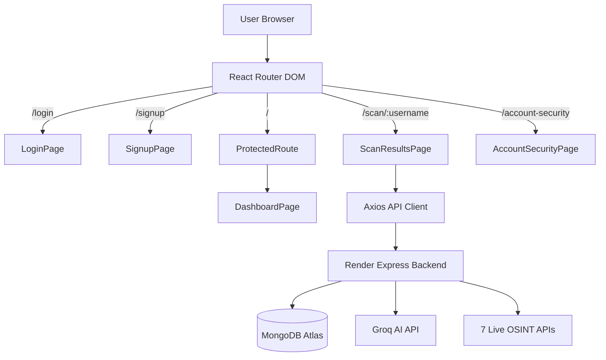

# 🔐 OpenTrace — AI-Powered Cyber Risk & OSINT Intelligence Platform

> An enterprise-grade, ethical OSINT platform for digital footprint analysis, cross-platform identity aggregation, and cyber risk assessment powered by Groq AI.


---

## 📸 Screenshots

### Authentication Portal


### Cyber Command Center


### Intelligence Scan & Cyber Risk Index


---

## ✨ Features & System Capabilities

- 🛡️ **Cryptographic Google OAuth Verification**: Full server-side Google ID Token verification using `google-auth-library` (`OAuth2Client.verifyIdToken`).
- 🌐 **7 Real-Time OSINT Integrations**: GitHub, Reddit, LeetCode (GraphQL), Stack Overflow, Dev.to, Gravatar, and HackerNews (Firebase REST API).
- 🧭 **React Router DOM Architecture**: Clean route-based navigation (`/login`, `/signup`, `/`, `/scan/:username`, `/account-security`) with client-side JWT expiration checking (`ProtectedRoute`).
- 📊 **Deterministic Risk Scoring Algorithm**: Zero `Math.random()`. Additive transparent risk scoring based on PII exposure, platform weighting, and account correlation.
- 🧬 **Unified Identity Card & Linkage Confidence**: Automated identity aggregation combining name variants, disclosed locations, confirmed external links, and earliest online footprints.
- ⚡ **Scan Diffing & Exposure Monitoring**: Compares new scan results against historical baselines to surface newly created or deactivated profiles.
- 🔐 **Ethical Breach & Exposure Audit**: Self-scoped XposedOrNot email breach lookup + K-Anonymity Pwned Passwords SHA-1 range checks (`api.pwnedpasswords.com/range/{first5}`).
- 🤖 **Groq AI Threat Intelligence**: Fast LLM inference generating actionable privacy remediation checklists and threat summaries.

---

## 💻 Tech Stack

| Layer | Technology | Purpose |
|---|---|---|
| **Frontend** | React 18 + Vite + React Router 6 | Route-driven SPA with instant hot-reloading |
| **UI Aesthetics** | Vanilla CSS (Cyberpunk) | Neon glassmorphism, glitch text, Matrix rain canvas |
| **Auth** | JWT + `google-auth-library` | Signed Google ID token verification & bcrypt hashing |
| **Backend** | Node.js + Express | Scalable REST API |
| **Database** | MongoDB Atlas | Cloud document storage & historical scan caching |
| **AI Engine** | Groq API (Mixtral 8x7b) | High-speed LLM inference for threat synthesis |
| **Hosting** | Vercel + Render | Global Edge CDN & microservice deployment |

---

## 🚀 Quick Start

### 1. Clone & Install Dependencies

```bash
git clone https://github.com/ankitrmishra01/OpenTrace.git
cd OpenTrace

# Install backend & frontend packages
cd server && npm install
cd ../frontend && npm install
```

### 2. Environment Configuration

**Backend Environment** (`server/.env`):
```env
PORT=5000
MONGODB_URI=mongodb+srv://<user>:<password>@cluster.mongodb.net/opentrace?retryWrites=true&w=majority
JWT_SECRET=your_super_secret_jwt_key_here
CLIENT_URL=https://open-trace-six.vercel.app
GROQ_API_KEY=gsk_your_groq_api_key
GOOGLE_CLIENT_ID=1066171516184-vfjr7593li9t1kmppcpldv3kofano9v0.apps.googleusercontent.com
GOOGLE_CLIENT_SECRET=your_google_client_secret
```

**Frontend Environment** (`frontend/.env`):
```env
VITE_API_URL=https://opentrace-server.onrender.com/api
VITE_GOOGLE_CLIENT_ID=1066171516184-vfjr7593li9t1kmppcpldv3kofano9v0.apps.googleusercontent.com
```

### 3. Run Locally

```bash
# Start backend (from server/ directory)
npm run dev

# Start frontend (from frontend/ directory)
npm run dev
```

- **Frontend**: `http://localhost:5173`
- **Backend API**: `http://localhost:5000/api`
- **Health Check**: `http://localhost:5000/health`

---

## 🏗️ Architecture & Component Routing



---

## 🔍 API Endpoints Summary

### Authentication Routes (`/api/auth`)
- `POST /api/auth/register` — Standard email/password registration.
- `POST /api/auth/login` — Email/password login issuing 7-day JWT.
- `POST /api/auth/google` — Server-side verification of Google ID token `{ credential }`.
- `GET /api/auth/user` — Fetch authenticated user profile (Protected).

### OSINT & Security Routes (`/api/scan`)
- `POST /api/scan/start` — Initiate 7-platform scan + permutation lookup (Protected).
- `GET /api/scan/history` — Retrieve user scan history & risk metrics (Protected).
- `GET /api/scan/:scanId` — Fetch specific scan result (Protected).
- `POST /api/scan/analyze` — Request Groq AI threat analysis (Protected).
- `GET /api/scan/account-security/email` — Self-scoped XposedOrNot breach lookup (Protected).
- `POST /api/scan/account-security/password` — K-Anonymity SHA-1 password check (Protected).

---

## 🛡️ Security & Privacy Boundary

1. **Cryptographic Google OAuth**: Google Sign-In credentials are verified server-side with Google's public keys via `google-auth-library`, preventing raw client parameter spoofing.
2. **Defensive API URL Resolution**: `frontend/src/services/api.js` automatically normalizes paths to ensure `/api` routes match target backends without trailing slash 404 errors.
3. **K-Anonymity Password Audit**: Only the first 5 characters of a SHA-1 password hash are transmitted to `api.pwnedpasswords.com/range/{first5}`. The raw password never leaves the client browser.
4. **Self-Scoped Breach Search**: Data breach checks are strictly restricted to the authenticated user's registered email (`req.user.email`).

---

## 📋 Disclaimer

OpenTrace is built strictly for **educational, security research, and personal privacy auditing purposes**. It queries public REST/GraphQL APIs and does not perform unauthenticated ToS-violating scraping or unauthorized data harvesting. Always respect platform terms and privacy regulations.

---

## 📄 License

MIT © 2026 OpenTrace — Built with ❤️ for Cybersecurity Awareness.
